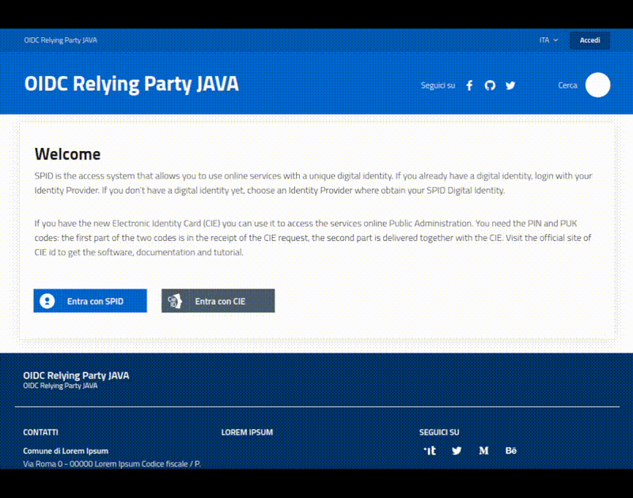

# SPID/CIE OIDC Federation, for Java

[](https://slack.developers.italia.it/)
[](https://developersitalia.slack.com/archives/C7E85ED1N/)

[](https://docs.oracle.com/en/java/javase/11/docs/api/)
[](https://github.com/italia/spid-cie-oidc-java/actions/workflows/codeql.yml)
[](https://codecov.io/gh/italia/spid-cie-oidc-java)

**SPID/CIE OIDC Federation (for Java)** is a **starter kit** and **example projects** designed to ease the creation of an OpenID Connect Federation.


> ⚠️ This project is a work-in-progress, the first. Currently only the **Relying Party** has been completed.
>
> 👀 Watch this repository over GitHub to stay informed.


**SUMMARY**

* [Features](#features)
* [Usage](#usage)
* [Docker](#docker)
* Example projects
  * [SpringBoot Relying Party example](#springboot-relying-party-example)
* [Useful links](#useful-links)
* Contribute
  * [Contribute as end user](#contribute-as-end-user)
  * [Contribute as developer](#contribute-as-developer)
* [License and Authors](#license-and-authors)


## Features

The purpose of this project is to provide a simple and immediate tool to integrate, in a WebApp developed with any Java Framework, the authentication services of SPID and CIE, automating the login/logout flows, the management of the OIDC-Core/OIDC-Federation protocols and their security profiles, and simplify the development activities.

It contains a _[starter-kit](starter-kit)_, a java library that exposes utilities, _helpers_ and _handlers_ you can include into your application in order to support the SPID/CIE OpenID Connect Authentication profile and OpenID Federation 1.0.

The library is developed using **Java 11** with a "Low Level Java" approach to limit dependencies and allowing it to be included into projects mades with high-level framework like Spring, SpringBoot, OSGi, Quarkus and many others java based frameworks.

Actually only "**OpenID Connect Relying Party**" _role_ is managed. The starter-kit provides:

* Federation Entity Jwks and Metadata creation
* OIDC Federation onboarding
* SPID and CIE OpenID Connect login and logout
* UserInfo claims retrieving
* Build (discover) TrustChain of OPs
* Multitenancy
* see [Usage](docs/USAGE.md) for a more detailed list


The "**OpenID Connect Provider**" _role_ is in my thoughts. Several requirements are already covered by the current starter-kit and the missing aspects should not require lot effort.

There are no plans to extends the starter-kit to allow you to implement an "**OpenID Connect Federation** Server".




## Usage

Both Snapshots and Released artifacts are available on [GitHub Packages](https://github.com/orgs/italia/packages?repo_name=spid-cie-oidc-java):

* if you use Maven

```xml
<dependency>
  <groupId>it.spid.cie.oidc</groupId>
  <artifactId>it.spid.cie.oidc.starter.kit</artifactId>
  <version><!--replace with the wanted version --></version>
</dependency>
```

* if you use Gradle

```gradle
implementation group:'it.spid.cie.oidc', name:'it.spid.cie.oidc.starter.kit', version: 'wanted-version'
```


Unfortunately, as stated in the [documentation](https://docs.github.com/en/packages/working-with-a-github-packages-registry/working-with-the-apache-maven-registry#authenticating-to-github-packages), to use GitHub packages you have define GitHub repository in your `~/.m2/settings.xml` together with your credentials.


The "starter-kit" is a _backend_ library with few dependencies:
* [`org.json:json`](https://github.com/stleary/JSON-java), a simple and light-weigth to parse and create JSON documents
* [`com.nimbusds:nimbus-jose-jwt`](https://connect2id.com/products/nimbus-jose-jwt), the most popular java Library to manage JSON Web Token (JWT, JWE, JWS)
* [`com.github.stephenc.jcip:jcip-annotations:1.0-1`](https://mvnrepository.com/artifact/com.github.stephenc.jcip/jcip-annotations/1.0-1), a clean room implementation of the JCIP Annotations
* [`org.slf4j:slf4j-api`](https://mvnrepository.com/artifact/org.slf4j/slf4j-api)


go [here](docs/USAGE.md) for more detailed information


## Docker

The "starter-kit" is a library.

Sample projects using the library can be executed as docker or docker-compose. See examples's documentation.


## Example projects

### SpringBoot Relying Party example

A simple [SpringBoot](examples/relying-party-spring-boot) web application using the starter-kit to implement a Relying Party, as well to perform the complete onboarding and login/logout test within the CIE Federation.

This application is for demo purpose only, please don't use it in production or critical environment.


## Useful links

* [Openid Connect Federation](https://openid.net/specs/openid-connect-federation-1_0.html)
* [SPID/CIE OIDC Federation SDK](https://github.com/italia/spid-cie-oidc-django)


## Contribute

Your contribution is welcome, no question is useless and no answer is obvious, we need you.

#### Contribute as end user

Please open an issue if you've discoverd a bug or if you want to ask some features.

#### Contribute as developer

This repository follow a [Trunk based Development](https://trunkbaseddevelopment.com/) approach:
* __main__ branch contains the evolution of the project, where developed code is merged
* __x-branch__ are short-lived feature branches always connected to one or more issues (to better track and motivate requirements)

At the moment there is a GitHub Action allowing [releasing from Trunk](https://trunkbaseddevelopment.com/release-from-trunk/).

Please open your Pull Request on the __main__ branch, but before start coding open an issue to describe your needs and inform the Team you are working on it.

In this project we adopt [Semver](https://semver.org/lang/it/) and
[Conventional commits](https://www.conventionalcommits.org/en/v1.0.0/) specifications.


## License and Authors

This software is released under the Apache 2 License by:

- Mauro Mariuzzo <mauro.mariuzzo@smc.it>.


